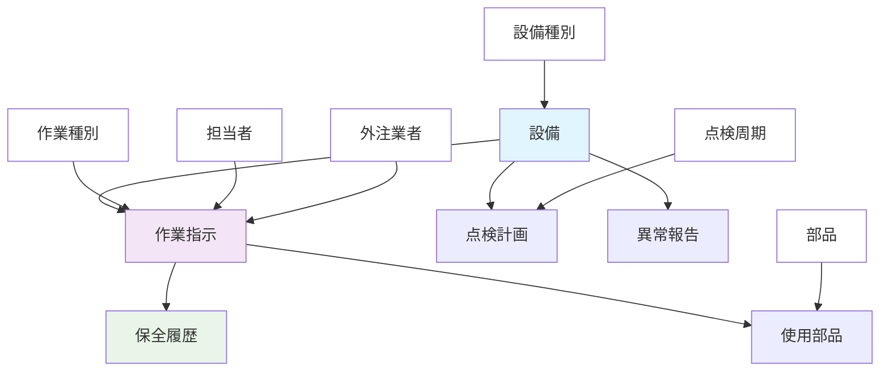
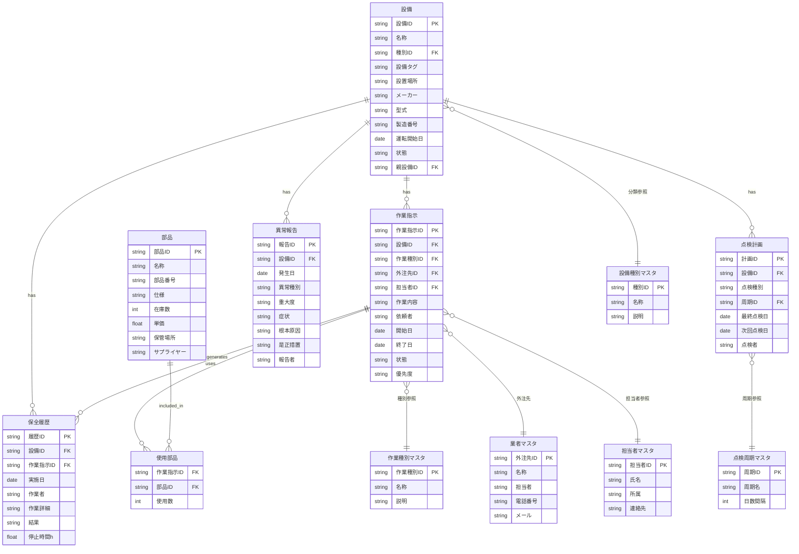

## 設備保全管理システムデータモデル

### 概念データモデル

**色の意味：**
- 🔵 **水色（設備）**: システムの中心概念・保全対象
- 🟣 **紫色（作業指示）**: 作業・業務プロセス
- 🟢 **緑色（保全履歴）**: 実績・記録データ
- ⚪ **白色**: マスタデータ（設備種別、作業種別、担当者、外注業者、点検周期、部品）
- ⚫ **デフォルト色**: その他の概念

#### 概念の関係性

**🏭 設備（中心概念）**
- 設備種別により分類される
- 複数の作業指示の対象となる
- 点検計画により定期保全される
- 異常発生時に異常報告が作成される

**📋 作業指示**
- 設備に対する保全作業の指示
- 作業種別により分類される
- 担当者または外注業者が実施
- 実施後に保全履歴が生成される
- 必要に応じて部品を使用する

**📊 保全履歴**
- 作業指示の実施結果として記録される
- 設備の保全実績を蓄積する

**🔧 点検計画**
- 設備の定期点検を計画する
- 点検周期により実施間隔が決まる

**⚠️ 異常報告**
- 設備の不具合発生時に作成される
- 原因分析と対策を記録する

### 論理データモデル(ER図)

