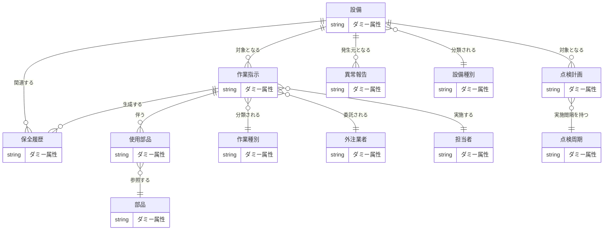
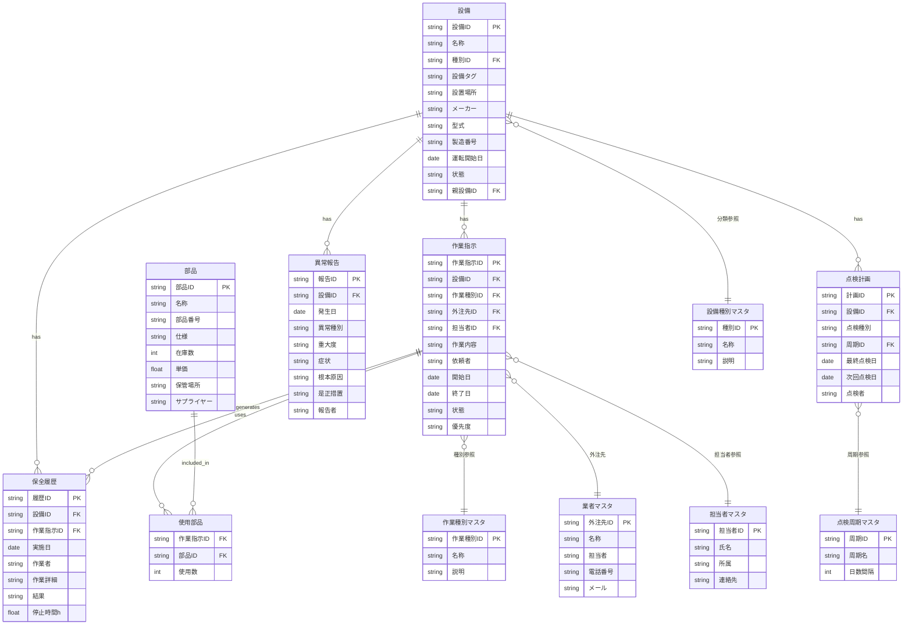

## 設備保全管理システムデータモデル

### 概念データモデル

```mermaid
erDiagram
  設備 ||--o{ 作業指示 : 対象となる
  設備 ||--o{ 保全履歴 : 関連する
  設備 ||--o{ 点検計画 : 対象となる
  設備 ||--o{ 異常報告 : 発生元となる
  作業指示 ||--o{ 保全履歴 : 生成する
  作業指示 ||--o{ 使用部品 : 伴う
  使用部品 }o--|| 部品 : 参照する
  作業指示 }o--|| 作業種別 : 分類される
  作業指示 }o--|| 外注業者 : 委託される
  作業指示 }o--|| 担当者 : 実施する
  設備 }o--|| 設備種別 : 分類される
  点検計画 }o--|| 点検周期 : 実施間隔を持つ

  設備 {
    string ダミー属性
  }

  設備種別 {
    string ダミー属性
  }

  作業指示 {
    string ダミー属性
  }

  作業種別 {
    string ダミー属性
  }

  保全履歴 {
    string ダミー属性
  }

  使用部品 {
    string ダミー属性
  }

  部品 {
    string ダミー属性
  }

  担当者 {
    string ダミー属性
  }

  外注業者 {
    string ダミー属性
  }

  点検計画 {
    string ダミー属性
  }

  点検周期 {
    string ダミー属性
  }

  異常報告 {
    string ダミー属性
  }

```

### 論理データモデル(ER図)

```mermaid

erDiagram
  設備 ||--o{ 作業指示 : has
  設備 ||--o{ 保全履歴 : has
  設備 ||--o{ 点検計画 : has
  設備 ||--o{ 異常報告 : has
  作業指示 ||--o{ 保全履歴 : generates
  作業指示 ||--o{ 使用部品 : uses
  部品 ||--o{ 使用部品 : included_in
  作業指示 }o--|| 作業種別マスタ : 種別参照
  作業指示 }o--|| 業者マスタ : 外注先
  作業指示 }o--|| 担当者マスタ : 担当者参照
  設備 }o--|| 設備種別マスタ : 分類参照
  点検計画 }o--|| 点検周期マスタ : 周期参照

  設備 {
    string 設備ID PK
    string 名称
    string 種別ID FK
    string 設備タグ
    string 設置場所
    string メーカー
    string 型式
    string 製造番号
    date 運転開始日
    string 状態
    string 親設備ID FK
  }

  設備種別マスタ {
    string 種別ID PK
    string 名称
    string 説明
  }

  作業指示 {
    string 作業指示ID PK
    string 設備ID FK
    string 作業種別ID FK
    string 外注先ID FK
    string 担当者ID FK
    string 作業内容
    string 依頼者
    date 開始日
    date 終了日
    string 状態
    string 優先度
  }

  作業種別マスタ {
    string 作業種別ID PK
    string 名称
    string 説明
  }

  担当者マスタ {
    string 担当者ID PK
    string 氏名
    string 所属
    string 連絡先
  }

  業者マスタ {
    string 外注先ID PK
    string 名称
    string 担当者
    string 電話番号
    string メール
  }

  保全履歴 {
    string 履歴ID PK
    string 設備ID FK
    string 作業指示ID FK
    date 実施日
    string 作業者
    string 作業詳細
    string 結果
    float 停止時間h
  }

  部品 {
    string 部品ID PK
    string 名称
    string 部品番号
    string 仕様
    int 在庫数
    float 単価
    string 保管場所
    string サプライヤー
  }

  使用部品 {
    string 作業指示ID FK
    string 部品ID FK
    int 使用数
  }

  点検計画 {
    string 計画ID PK
    string 設備ID FK
    string 点検種別
    string 周期ID FK
    date 最終点検日
    date 次回点検日
    string 点検者
  }

  点検周期マスタ {
    string 周期ID PK
    string 周期名
    int 日数間隔
  }

  異常報告 {
    string 報告ID PK
    string 設備ID FK
    date 発生日
    string 異常種別
    string 重大度
    string 症状
    string 根本原因
    string 是正措置
    string 報告者
  }

```
